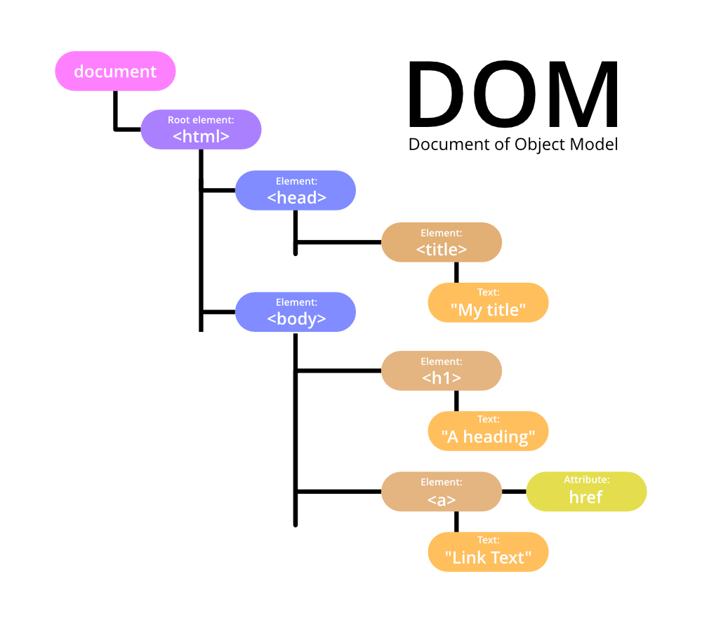
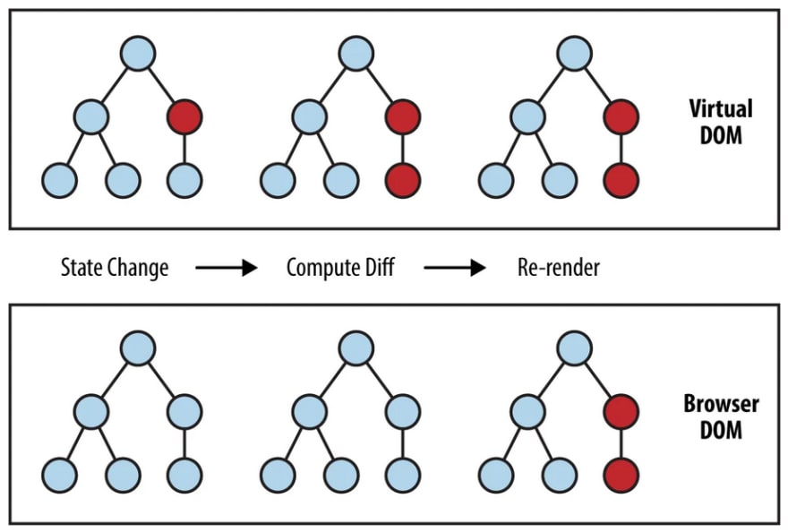

# 리액트

## Table of Contents

- [상태관리를 왜 할까요? 그리고 평소 state 관리는 어떻게 하시나요?✅](#1)
- [Redux가 무엇인가요, 왜 Redux를 사용하시나요?✅](#2)
- [Redux 말고 다른 전역 상태관리 아는 것 하나와 차이점을 말해주세요 ✅](#3)
- [버츄얼 돔과 리얼 돔의 차이를 설명해주세요 ✅](#4)
- [useRef에 대해 설명해보세요 ✅](#5)
- [useEffect의 실행 순서에 대해 설명해주세요 ✅](#6)
- [var, let, const의 차이에 대해 알려주세요. ✅](#7)
- [Async/Await와 Promise의 차이 ✅](#8)
- [데이터 10,000개를 가지고 무한 스크롤 구현시에 가장 중요하게 고려해야 할점은? ✅](#9)
- [CloudFront를 사용해본적이 있나요? 사용해봤다면, CloudFront로 배포하는 이유를 설명해주세요.✅](#10)
- [useEffect와 useLayoutEffect 차이에 대해 설명해주세요](#11)
- [Closure란?](#12)
- [Javascript 호이스팅에 대해 설명해주세요.](#13)
- [프로세스 생성 과정에 대해 설명해보세요](#14)
- [HTTPS란](#15)
- [TCP란 무엇인가](#16)
- [TCP와 UDP의 차이점은?](#17)
- [브라우저에서 주소창에 url 입력시 어떤일이 일어나는가](#18)
- [JavaScript Event Loop](#19)
- [RESTFul API란](#20)
- [GET, POST 방식의 차이점](#21)
- [Webpack 써보신 적 있나요](#22)
- [TCP와 UDP의 차이점](#23)
- [동기와 비동기의 차이](#24)
- [Array vs LinkedList](#25)
- [서버 사이드 렌더링이란?](#26)
- [MVC 패턴이란 무엇인가?](#27)
- [아토믹 디자인 패턴에 대해 아는가?](#28)
- [웹 스토리지의 차이점](#29)
- [http vs https 차이점에 대해 설명해주세요](#30)
- [웹 프로토콜이란?](#31)
- [AJAX란 무엇인가](#32)
- [Promise와 Callback의 차이점은](#33)
- [자바스크립트와 타언어의 차이점](#34)
- [ES6의 호환성 해결방법은?](#35)
- [babel은 컴파일러 인가 ? 트랜스파일러인가?](#36)
- [ES6에 추가된 것은 무엇인가?](#37)
- [Context API란?](#38)
- [라이프사이클 메소드에 대해 설명](#39)
- [react 클래스형과 함수형의 차이](#40)
- [타입스크립트란?](#41)
- [Angular와 React의 차이점](#42)
- [SEO란?](#43)
- [이벤트 위임이란?](#44)
- [메모이제이션이란?](#45)
- [이벤트 버블링이란](#46)
- [부모에서 자식으로 이벤트상속방법](#47)
- [이벤트버블링을 막는 방법](#48)
- [이벤트버블링 활용 방법](#49)
- [React, 왜 사용하시나요?](#50)

## 1

React에서의 상태관리란 데이터에 맞게 적절하게 UX와 UI를 설계하고 구현하는게 상태관리이다.
상태관리가 필요한 이유는 상태관리를 어떻게 하느냐에 따라 의미없는 리렌더 등 성능 이슈를 해결할 수 있고
어떤 상태 라이브러리를 활용하여 어떤구조로 상태관리를 설계해서 다루냐에 따라 유지보수 관점에서 코드의
라이프 사이클이 크게 짧아질수도 길어질수도 있기 때문이다. 먼저 상태관리의 예시를 들면

예를 들어, 인스타그램에서 팔로워수가 많아져서 1억명의 팔로워수가 생겼을때, 1명의 팔로워를 1로 표기하는 것과
1억명의 팔로워를 100000000이라고 표기하기에는 유저입장에서 읽기도 힘들고 너무길어 불필요하게 Box를 많이 차지하는
현상이 발생한다. 이렇게 표기하기에는 1.0억이라고 표기하는게 눈에 더 쉽게 들어오고 UI에 잘 맞다.

이렇게 동적으로 팔로워 상태를 바꾸며 이러한 행동을 팔로워 수 표기의 상태관리라고 한다. 이러한 상태관리는 팔로워 수
뿐만 아니라 댓글이 달려서 하트표시의 댓글이 달린 것이 UI적으로 변한 것을 알 수 있으며 이러한 상태관리는 실시간
상태관리라고 한다. 또한 프로필이 로딩상태일때 잠시 나오는 스피너나 Skeleton UI로 로딩중 표시를 노출 하는 것 또한
로딩상태관리라고 부릅니다. 이러한 상태관리 외에 에러 예외 상황에 대한 상태관리, 로그인한 유저의 권한을 보여주는 상태관리 등
프론트엔드에 쓰이는 상태는 매우 종류가 많고 상태의 조합에 따른 경우의 수를 다 고려해야 한다.

리액트 상태는 이렇게 역할외에도 범위의 측면에서 볼 때 State가 적은 수의 component또는 depth가 깊지 않은 component안에서
영향을 주는 지역상태(local state)또는 많은 컴포넌트와 depth가 깊은 component에 영향을 주는 전역적상태(global state)로 나눌 수 있다.

평소 state관리는 이러한 역할과 범위 측면에 따라 나누어 최소한의 리렌더링 및 페이지 성능을 최대한 끌어올리는 방향으로 관리하고
있습니다.

Reference:

- [프론트엔드의 상태관리란 무엇인가?](https://medium.com/wematch/%ED%94%84%EB%A1%A0%ED%8A%B8%EC%97%94%EB%93%9C%EC%9D%98-%EC%83%81%ED%83%9C%EA%B4%80%EB%A6%AC%EB%9E%80-%EB%AC%B4%EC%97%87%EC%9D%B8%EA%B0%80-5ff888dab7ad)
- [React state management: What is it and why to use it?](https://www.loginradius.com/blog/engineering/react-state-management/)
- [리액트 상태 관리 가이드](https://www.stevy.dev/react-state-management-guide/)

[🔝 목차로 돌아가기](#table-of-contents)

## 2

Redux는 프론트엔드 상태관리 라이브러리이다. Redux는 웹의 규모가 커지면서 components가 점점 잘게 쪼개지며 한 컴포넌트의 depth
단위가 점점 깊어지면서 부모에서 자식간의 props를 전달하는 과정에서 해당 props가 불필요한 component에서도 전달 받고 보내야 하는
상황인 props drilling 문제와 똑같은 depth level의 자식이 state을 관리할때 props를 서로 전달받을 수 없는 상황에 state을 store라는
제 3자의 공간에서 components들이 필요한 상태를 담아 적절히 필요할 때 언제든지 꺼내고 새로운 state을 업데이트 할 수 있게
도와주는 효과적인 라이브러리이다.

Redux를 항상 써야 하는 건 아니지만 components 단위의 depth가 깊거나 같은 레벨의 depth의 child component에서 props를 전달받아야
하는 상황일 때 쓰면 효과적이다. 또한 리액트에 내장된 Context API로 글로벌상태를 관리할 수 있지만 성능면에서 차이가 난다.
Redux에서는 components에서 글로벌 상태의 특정 값을 의존하게 될 때 해당 값이 바뀔 때에만 리렌더링이 되도록 최적화가 되어있다.
따라서, 글로벌 상태 중 의존하지 않는 값이 바뀌게 될 때에는 컴포넌트에서 낭비 렌더링이 발생하지 않는다.

Reference:

- [리덕스, 어떻게 해야 잘 쓸까](https://ridicorp.com/story/how-to-use-redux-in-ridi/)
- [Redux FAQ: General](https://redux.js.org/faq/general)
- [Redux(리덕스)란?](https://hanamon.kr/redux%EB%9E%80-%EB%A6%AC%EB%8D%95%EC%8A%A4-%EC%83%81%ED%83%9C-%EA%B4%80%EB%A6%AC-%EB%9D%BC%EC%9D%B4%EB%B8%8C%EB%9F%AC%EB%A6%AC/)

[🔝 목차로 돌아가기](#table-of-contents)

## 3

Redux외에 여러 상태관리 라이브러리가 있지만 그 중 Recoil에 대한 언급을 하고 싶다. Recoil은 페이스북에서 만든 Context API
기반으로 구현된 함수형 컴포넌트에서만 사용가능한 상태관리 라이브러리이다. Redux는 효과적인 상태관리 라이브러리이지만
너무 많은 보일러 플레이트를 파일마다 반복 작성해야 하는 큰 단점이 있었다. 예를 들어 리덕스 액션과 리듀서들을 도메인마다
분리를 하고 리액트 각 컴포넌트마다 바인딩을 하게 될 시 많은 파일에서 리덕스 코드를 사용하게 되고 많은 양의 보일러 플레이트
코드를 반복해야해서 관리포인트가 많다는 단점이 있었다.

이러한 보일러플레이트를 해결하고 Redux Thunk와 Redux Saga(비동기처리 라이브러리)등 비동기 처리 미들웨어를 추가로 설치하지
않아도 되는 Redux Toolkit이 등장하였지만 아직 recoil에 비해 보일러플레이트가 높으며 recoil은 기존 React의 내장 Hooks사용하는
방식과 유사하며 어플리케이션을 RecoilRoot으로 감싸고 데이터를 atom(작은 단위로 컴포넌트들이 구독할 수 있는 단위)이라는 단위로
선언하여 useState을 Recoil의 useRecoilState으로 대체하는 특징을 가지고 있다.

Recoil의 selector를 활용하여 쉽게 비동기 데이터를 가져올 수 있으며 추가적인 라이브러리 설치가 불필요해 프로젝트 번들이 가벼우며
기존의 Redux의 중앙집중식으로 상태관리가 이루어지며 단방향인 Flux 아미텍처와 달리 저장소 개념보다 작은 상태 단위인 atom이라는
상태 단위로 상태를 관리하여 컴포넌트는 이 atom을 구독하기만 하면 된다는 큰 차이점을 가지고 있다.

- [Recoil Code 예시](./code/recoil.jsx)

<details markdown="1">
<summary>Redux와 Recoil</summary>


</details>

Reference:

- [Redux vs Recoil: which should you use?](https://www.emgoto.com/redux-vs-recoil/)
- [Reducing Boilerplate](https://redux.js.org/usage/reducing-boilerplate)
- [Recoil, 리액트의 상태관리 라이브러리](https://tech.osci.kr/2022/06/16/recoil-state-management-of-react/)

[🔝 목차로 돌아가기](#table-of-contents)

## 4

DOM은 Document Object Model의 약자로 HTML 문서에 있는 모든 node의 구조적 표현이다. DOM은 어플리케이션의 UI를
나타내며 이러한 웹페이지의 UI를 동적으로 변경하려면 DOM 조작이 필요하다. DOM은 스크립트가 문서의 내용, 스타일 및
구조를 업데이트 할 수 있도록 하는 인터페이스이다.

실제 DOM은 논리적 트리가 있는 문서라고 불리며 트리의 각 분기는 노드로 끝나며 각 노드에는 객체가 포함이 된다.
DOM은 트리와 같은 구조로 인해 빠르지만 변경 후에는 업데이트가 된 요소와 자식들을 다시 렌더링하여 어플리케이션
UI를 업데이트해야 하여 UI를 재렌더링시 모든 UI 구성 요소가 느려진다. 모든 DOM 업데이트에 대해 렌더링이 되므로
실제 DOM은 업데이트를 수신하는 특정 항목뿐만이 아닌 전체 목록을 렌더링하게 된다.

이러한 문제를 해결하고자 React에서는 모든 DOM객체에 해당하는 "가상 DOM객체"가 있다. 가상 DOM객체는 실제 DOM객체와
동일한 속성을 갖지만 화면에 있는 내용을 직접 변경할 수는 없다. 가상DOM을 조작하는 것은 화면에 직접 그리지 않기
때문에 실제DOM보다 훨씬 빠르며 React는 우선 모든 단일 가상 DOM을 업데이트하며 이후 가상 DOM이 업데이트 되면 그
전 가상 DOM과 비교하여 어떤 가상 DOM 요소가 변경되었는지 알아내며 해당 요소만 업데이트 하게 하는 "diffing"이라는
프로세스를 실행합니다.

Reference:

- [The Document Object Model](https://eloquentjavascript.net/14_dom.html)
- [React: The Virtual DOM](https://www.codecademy.com/article/react-virtual-dom)
- [Difference between Virtual DOM and Real DOM](https://www.geeksforgeeks.org/differnece-between-virtual-dom-and-real-dom/)

<details markdown="1">
<summary>실제DOM과 가상DOM 원리(React)</summary>




</details>

[🔝 목차로 돌아가기](#table-of-contents)

## 5

Javascript에서는 우리가 특정 DOM을 선택해야 하는 상황에는 getElementById, querySelector와 같은 DOM Selector 함수를
사용해서 DOM을 선택한다. 리액트에서도 스크롤바 위치를 가져오거나 선택하고, 포커스를 설정하는 등 DOM을 직접 선택해야
하는 상황이 있고 특정 DOM을 감시하고 가리킬 때 useRef Hook을 사용한다. 그리고 해당 DOM의 특정 값을 가져올 때
.current.value, .current.focus등의 코드로 해당 DOM의 값을 불러올 수 있습니다.

- [useRef Code 예시](./code/useRef.jsx)

Reference:

- [후크 API 참조](https://reactjs.org/docs/hooks-reference.html#useref)
- [useRef로 특정 DOM 선택하기](https://react.vlpt.us/basic/10-useRef.html)

[🔝 목차로 돌아가기](#table-of-contents)

## 6

useEffect Hook은 의존성배열(dependency array)내에 지정된 값의 변화가 일어났을 때 실행이 된다. 이러한 특성으로 주로
컴포넌트가 마운트가 될 때 API를 통해 데이터를 가져오거나 state 또는 props 값이 변경될 때 특정 함수를 실행시키는 작업을
하는데 사용이 된다.

컴포넌트 구조가 top -> bottom으로 가는 구조 App > FirstBox > SecondBox일때 useEffect는 컴포넌트가 렌더링이 된 후에 실행이
되기 때문에 App이 render가 되기 위해서는 FirstBox가 렌더링이 되어야 하고 FirstBox가 완전히 렌더링이 되기 위해서는 SecondBox가
렌더링이 되어야 한다. 그렇게 1 -> 2 -> 3 순서대로 실행이 되는 것이 아닌 3 -> 2 -> 1 순서대로 실행이 된다.

- [useEffect Code 순서](./code/useEffect.jsx)

Reference:

- [useEffect의 동작 원리](https://jungpaeng.tistory.com/92)
- [What's useEffect execution order and its internal clean-up logic in react hooks?](https://stackoverflow.com/questions/53781632/whats-useeffect-execution-order-and-its-internal-clean-up-logic-in-react-hooks)
- [Library Hooks](https://reactjs.org/docs/hooks-reference.html#library-hooks)

[🔝 목차로 돌아가기](#table-of-contents)

## 7

var, let, const는 공통적으로 변수 선언문들인데 스코프 레벨에 따라 var는 함수 레벨 스코프이며 let, const는 블럭 레벨 스코프이다.
var, let, const 모두 호이스팅이 가능하지만 var의 경우 호이스팅이 되면서 초기값이 없어도 자동으로 undefined를 초기값으로
메모리 할당하는 특징이 있다. 하지만 let, const는 선언 전에 메모리에 해당 변수가 존재하지 않는다. 이럴 때 ReferenceError:
Cannot access 식별자명 before initialized가 발생한다.

var, let은 값을 재할당할수 있으며 const 같은 경우는 한번 할당한 값을 변경할 수 없다(객체 속 property 변경 x). 변수를 가리키는
값 자체를 변경하려고 할 때는 에러가 발생하지만 객체 내 property 추가, 수정, 삭제일 경우는 에러가 발생하지 않는다. 만약 객체
property를 변경하고 싶은 경우 Object.freeze()를 활용하면 된다. 그리고 중복변수명 선언일 경우 var는 이미 존재하는 동일한
변수명이 선언 가능하지만 let, const일 경우는 에러를 발생시킨다.

Reference:

[var, let, const: what's the difference?](https://dev.to/romaintrotard/var-let-const-what-s-the-difference-2eh0)
[Difference between var, let and const keywords in JavaScript](https://www.geeksforgeeks.org/difference-between-var-let-and-const-keywords-in-javascript/)

[🔝 목차로 돌아가기](#table-of-contents)

## 8

Promise는 자바스크립트에서 비동기 처리에 사용되는 객체이며 내용은 실행되었지만 결과를 아직 반환하지 않은 객체를 의미한다.
async, await은 가장 최근에 나온 비동기 처리 문법으로 기존의 callback이나 Promise의 단점을 해소하고자 만들어졌다.
Promise에는 3가지 상태(Pending - 대기, Fulfilled - 이행, Rejected - 실패)가 있으며 async, await은 이러한 상태가
없으며 promise 자체를 리턴하거나 실패처리 합니다.

"fxn1" 함수가 Promise이후에 실행되는 경우, promise.then(fxn1)은 fxn1 호출을 콜백 체인에 추가한 후 현재 함수의 실행을
계속하며 async,await일 경우 함수 "fxn1"이 await후에 실행되는 경우 await X()는 현재 함수의 실행을 일시 중단한 후
fxn1이 실행이 된다.

Promise에는 오류처리를 .then() 과 .catch() 메소드를 사용하며 async/await은 에러를 따로 핸들링 할 기능이 없기에 try-catch()
문을 활용하여 에러를 핸들링 해주어야 한다. Promise에서는 끝없는 .then() 사용 가능성이 있어 가독성이 좋지 않으며 async/await은
비동기 코드가 동기 코드처럼 읽히며 코드의 흐름을 이해하기 더 쉬운 편이다.

Reference:

[Difference between promise and async await in Node.js](https://www.geeksforgeeks.org/difference-between-promise-and-async-await-in-node-js/)

[🔝 목차로 돌아가기](#table-of-contents)

## 9

데이터가 일정 숫자가 많아질 때 기존의 무한 스크롤 구현 방법 중 스크롤 위치에 따라 bottom을 터치 시 새로운 페이지를 불러오는 방식에
특정한 조건을 걸지 않을 시 렌더링이 생각보다 많이 일어날 가능성이 있다. 이러한 문제를 해소시키고자 다양한 방법이 있는데 우선
lazy loading과 suspense를 사용하여 지연로딩을 통해 빠른 초기 로딩속도(FCP)를 가져가면서 스크롤이 많이 쌓여가는 방법을 어느정도 해소
시키는 방법이 있다. 또한 적절한 useMemo()와 useCallback()함수를 통하여 연산한 값을 재사용하거나 get하는 함수 자체를 page나 loading이 바뀔때마다 재사용하여 불필요한 리렌더링을 방지하는 방법또한 있다.

하지만 애초에 페이지를 많이 불러오면 그 내용을 그리기 위해 DOM 노드가 많이 생기는데 노드가 증가하면 렌더링하는 시간도 선형적으로 증가하기에 데이터를 추가로 덧붙인다는 생각의 접근은 이 근본적인 문제를 해결할 수 없다. 그리하여 유저가 보려고 하는 데이터만
불러와서 표시하는 방법의 접근이 필요하다. 즉 화면에 현재 표시되는 객체만 표시하고 나머지는 빈칸으로 두어 DOM 노드수를 절약하며 유저가 실제로 보고 싶어하는 데이터만 가져와서 유저가 어느 방향으로 스크롤하든 이어서 더 불러오게 가능하게 하면 된다는 것이다.

화면에 이렇게 표시되는 객체만 그리는 작업을 "DOM 가상화"라고 하며 이를 위하여 react-virtualized 또는 더 용량이 작은 react-window등의 라이브러리를 활용하여 한 줄에 보여줄 카드 수를 렌더링하는 시점에 미리 넣는 방법으로 구현하는 방법들이 있다.

Reference:

[오늘의집 내 무한 스크롤 개발기](https://www.bucketplace.com/post/2020-09-10-%EC%98%A4%EB%8A%98%EC%9D%98%EC%A7%91-%EB%82%B4-%EB%AC%B4%ED%95%9C%EC%8A%A4%ED%81%AC%EB%A1%A4-%EA%B0%9C%EB%B0%9C%EA%B8%B0/)

[🔝 목차로 돌아가기](#table-of-contents)

## 10

Cloudfront를 사용해본적이 있다. Cloudfront는 .html, .css, .js와 같은 정적 및 동적 웹 콘텐츠를 사용자에게 더 빨리 배포하도록 지원하는 웹 서비스입니다. Cloudfront에는 엣지 로케이션이라고 하는 데이터 센터의 전 세계 네트워크를 통해 콘텐츠를 제공하며 사용자가 요청하면 지연 시간이 가장 낮은 엣지 로케이션으로 요청이 라우팅되기에 가능한 최고의 성능으로 콘텐츠 제공. 이렇게 세계 곳곳에 서버를 구축하는게 힘들며 모든 리전에 EC2 인스턴스나 S3 버킷을 생성하는건 비효율적이며 비용이 많이 드는 문제를 Cloudfront를 이용하여 전송속도 향상과 비용절감을 이룰 수 있다. 또한 Cloudfront 엣지 캐시에서 파일이 만료되기 전에 파일을 제거해야 할 경우 엣지 캐시에서 파일을 무효화 할 수 있으며 이 과정은 Github Actions 등을 통하여 자동화를 할 수 있다.

<details markdown="1">
<summary>Cloudfront 작동 Table</summary>


</details>

Reference:

[Amazon CloudFront란 무엇입니까?](https://docs.aws.amazon.com/ko_kr/AmazonCloudFront/latest/DeveloperGuide/Introduction.html)
[파일 무효화](https://docs.aws.amazon.com/ko_kr/AmazonCloudFront/latest/DeveloperGuide/Invalidation.html)

[🔝 목차로 돌아가기](#table-of-contents)

## 11

- Render: DOM Tree 를 구성하기 위해 각 엘리먼트의 스타일 속성을 계산하는 과정
- Paint: 실제 스크린에 Layout을 표시하고 업데이트하는 과정

useEffect는 components들이 render와 paint가 완료된 후 실행이 된다. 이 과정은 비동기적으로 실행이 되며 paint된 후 실행이 되기 때문에 useEffect 내부에 DOM에 영향을 주는 코드가 존재할 경우 사용자는 화면의 깜빡임 현상을 겪게 된다.

useLayoutEffect는 components들이 render된 후 실행되며 그 이후에 paint가 된다. 이 과정은 동기적으로 실행이 되며 paint 되기 전에 실행이 되기 때문에 DOM에 영향을 주는 코드가 존재하여도 사용자는 화면의 깜빡임 현상을 겪지 않는다.

그리하여 useLayoutEffect는 동기적으로 실행이되고 내부의 코드가 모두 실행된 경우 painting 작업을 거치기 때문에 로직이 복잡할 경우 사용자가 레이아웃을 보는데까지 시간이 오래 걸린다는 문제가 있어서 데이터 fetch, event handling, state reset등의 작업은 useEffect를 사용하기를 권장하지만 화면이 깜빡거리는 상황일 때 state이 조건에 따라 첫 painting시 다르게 렌더링 되어야 하는 상황일때는 useLayoutEffect를 사용하기를 권장한다.

<details markdown="1">
<summary>useEffect와 useLayout Life Cycle</summary>


</details>

Reference:

[What is the real difference between React useEffect and useLayoutEffect?](https://pubudu2013101.medium.com/what-is-the-real-difference-between-react-useeffect-and-uselayouteffect-51723096dc19)

[🔝 목차로 돌아가기](#table-of-contents)

## 12

클로저는 자바스크립트 고유의 개념이 아니라 함수를 일급 객체로 취급하는 함수형 프로그래밍 언어에서 사용되는 중요한 특성이다. 클로저에 대해 MDN은 아래와 같이 정의하고 있다

> “A closure is the combination of a function and the lexical environment within which that function was declared.”
> 클로저는 함수와 그 함수가 선언됐을 때의 렉시컬 환경(Lexical environment)과의 조합이다.

클로저는 반환된 내부함수가 자신이 선언됐을때의 환경인 스코프를 기억하여 자신이 선언됐을 때의 환경(스코프) 밖에서 호출되어도 그 환경(스코프)에 접근할 수 있는 함수를 말한다. 이를 쉽게 풀자면 클로저는 자신이 생성될 때의 환경을 기억하는 함수다.

- [Closure 코드](./code/closure.js)

displayName()함수가 실행되기 전에 외부함수인 makeFunc()로부터 리턴되어 myFunc 변수에 저장된다. makeFunc() 실행이 끝나면(displayName함수가 리턴되고 나면) name 변수에 더 이상 접근할 수 없게 될 것으로 예상하는 것이 일반적이지만 위의 예시와 같이 자바스크립트는 함수를 리턴하고, 리턴하는 함수가 클로저를 형성하는 예시일경우 displayName의 인스턴스는 변수 name 이 있는 어휘적 환경에 대한 참조를 유지한다. 이런 이유로 myFunc가 호출될 때 변수 name은 사용할 수 있는 상태로 남게 되고 "Mozilla" 가 alert 에 전달된다.

클로저는 어떤 한 데이터와 그 데이터를 조작하는 함수를 연관시켜주기에 용이하다. 이것은 객체가 어떤 데이터와(그 객체의 속성) 하나 혹은 그 이상의 메소드들을 연관시킨다는 점에서 객체지향 프로그래밍과 같은 맥락에 있다. 결론적으로 오직 하나의 메소드를 가지고 있는 객체를 일반적으로 사용하는 모든 곳에 클로저를 사용할 수 있다.

reference:

[클로저](https://developer.mozilla.org/ko/docs/Web/JavaScript/Closures)
[클로저(closure)의 개념](https://poiemaweb.com/js-closure)

[🔝 목차로 돌아가기](#table-of-contents)

## 13

Javascript(interpreter 언어 - 개발자 도구 컨솔에서 스크립트를 작성해 실행하는데 컴파일이 필요하지않다)에서 호이스팅(hoisting)이란 인터프리터가 변수와 함수의 메모리 공간을 선언 전에 미리 할당하는 것을 의미한다. var로 선언한 경우에는 호이스팅 시 undefined로 변수를 초기화하며 let 또는 const로 선언한 변수의 경우에는 호이스팅 시 변수를 초기화 하지 않는다.

- [Hoisting 코드](./code/hoisting.js)

예를 들어 위의 코드 처럼 일반적으로는 함수를 선언한 후 함수를 호출하는 코드를 뒤에 적는게 일반적으로 보이지만 Javascript는 함수의 코드를 실행하기 전에 함수선언에 대한 메모리부터 할당하기 때문에 함수를 호출하는 코드를 함수 선언보다 앞서 배치할 수 있다.

JavaScript는 초기화를 제외한 선언만 호이스팅하기에 변수를 먼저 사용하고 그 후에 선언 및 초기화가 나타나면 사용하는 시점의 변수는 기본 초기화 상태이다.

```jsx
console.log(num); // 호이스팅한 var 선언으로 인해 undefined 출력
var num; // 선언
num = 6; // 초기화
```

하지만 아래와 같이 선언 없이 초기화만 존재할 경우 ReferenceError 예외가 발생하게 된다. 그리고 let과 const로 선언한 변수도 호이스팅의 대상이지만 var와 달리 hoisting시에는 undefined로 변수를 초기화하지 않기 때문에 변수의 초기화를 수행하기 전에 읽는 코드가 먼저 나타날 시 예외 에러가 발생하게 된다. 이는 해당 let,, const로 선언된 변수는 스코프의 시작에서 변수의 선언까지 일시적 사각지대(Temporal Dead Zone;TDZ)에 빠지게 되기 때문이다.

```jsx
console.log(num); // ReferenceError
num = 6; // 초기화
```

Reference:

[호이스팅](https://developer.mozilla.org/ko/docs/Glossary/Hoisting)
[호이스팅(Hoisting)이란?](https://hanamon.kr/javascript-%ED%98%B8%EC%9D%B4%EC%8A%A4%ED%8C%85%EC%9D%B4%EB%9E%80-hoisting/)

[🔝 목차로 돌아가기](#table-of-contents)

## 14

운영체제는 프로그램을 메모리의 적당한 위치로 가져온다. 또한 PCB(Process Control Control)라는 제어블록을 생성하며 PCB에는 프로세스 실행에 필요한 여러가지 정보가 담겨있다. 비유한다면 프로세스는 요리를 만드는 과정이며 PCB는 요리를 만들 때 고려할 사항을 적어놓은 주문서라고 비유할 수 있다. 오늘 날의 프로세스는 효율적인 처리를 위해 다양한 상태를 가지고 있으며 그 중 생성상태는 프로그램이 메모리에 올라오고 PCB를 할당받은 상태이다. 생성된 프로세스는 바로 실행되는 것이 아닌 준비 상태가 되어 자신의 순서를 기다리게 된다
(메모리 할당 & PCB 생성)

일반적인 프로세스 생성 과정

> 1. PCB(Process Control Block)가 생성되며 OS가 실행한 프로그램의 코드를 읽어들여 프로세스에 할당된 메모리의 Text segment에 저장한다.
> 2. 초기화된 전역 변수 및 static 변수를 data segment에 할당.
> 3. HEAP과 Stack은 초기 메모리 주소만 초기화됨.
> 4. PCB에 여러 정보가 기록되면 Ready Queue에서 CPU를 할당받기까지 대기한다.

<details markdown="1">
<summary>Process Cycle Example</summary>


</details>

Reference:
[프로세스와 PCB](https://velog.io/@dbstjrwnekd/%ED%94%84%EB%A1%9C%EC%84%B8%EC%8A%A4%EC%99%80-PCB)

[🔝 목차로 돌아가기](#table-of-contents)

## 15

HTTPS(Hypertext Transfer Protocol Secure)는 HTTP 프로토콜의 보안 버전이다. HTTP와는 달리 추가 암호화, 인증, 그리고 HTTP 프로토콜 통합 서비스를 제공한다. HTTP와 달리 HTTPS에서는 제 3자가 접근하거나 정보를 가로채려고 하는 행위를 방지할 수 있으며 웹 사이트의 SSL/TLS 증명서 포함하는 서버가 공개 키 암호화와 SSL/TLS Handshake등으로 암호화된 소통을 할 수 있다. 인증방식은 SSL/TLS 증명서에 해당 개인키(private key) 를 소유한 누군가가 디지털 서명했는지 확인하는 데 사용할 수 있는 공개키(public key) 가 포함되어 있다.

서버의 인증서가 SSL.com과 같이 공개적으로 신뢰할 수 있는 인증기관(CA)에 의해 서명된 경우 브라우저는 인증서에 포함된 모든 식별 정보가 신뢰할 수 있는 제 3자에 의해 검증되어있음을 수락한다.

HTTPS는 검색결과 엔진 최적화에도 포함이 된다. 특히 개인적으로 Lighthouse에서 SEO 점수를 최적화 하는데 https를 적용하는 것 또한 해당 지표 점수를 향상시키는데 큰 역할을 할 수 있다.

Reference:

[What is HTTPS?](https://www.ssl.com/faqs/what-is-https/#)

[🔝 목차로 돌아가기](#table-of-contents)

## 16

네트워크를 4계층으로 나눌 때 네트워크인터페이스 계층 ,인터넷 계층, 트렌스포트 계층, 어플리케이션 계층 으로 나눈다. TCP는 이 중 트랜스포트 계층에 해당하며 대표적인 프로토콜은 TCP, UDP 중 하나이다. TCP는 웹이나 이메일과 같이 데이터가 정확하게 전달되어야 하는 통신에서 사용된다. 통신을 맺고 끊는 과정에서 클라이언트와 서버간 확인 절차를 거치는데, 이러한 특징으로 연결지향 프로토콜이라고 한다.

TCP는 데이터의 정확한 전달을 중시하는 프로토콜이며 데이터 전송에 신뢰성을 더하기 위해서 데이터를 세그먼트 단위로 분할하고, 전송 속도를 조절하며, 데이터가 제대로 전달되지 않았을 경우 재전송을 한다. TCP의 세그먼트는 데이터 본체에 TCP헤더가 붙은 형태로 구성이 된다. TCP헤더에는 포트번호나 일련번호와 같은 정보가 포함되어 있다. TCP통신은 커넥션을 맺는 단계는 3단계로 진행되며 이를 3방향 핸드쉐이크 라고 한다. 커넥션이 맺어지면 데이터를 전송할 수 있는 상태가 되고, 데이터 전송이 끝나면 커넥션을 끊게 된다.

TCP가 통신을 맺는 과정은(3 way hand shake)

> 클라이언트는 서버에 접속요청(sync), 클라이언트는 sync_sent 상태
> 서버는 요청수락(sync+ack), 서버는 sync_received 상태
> 클라이언트는 서버에 수락확인(ack) 전달, 서버는 established 상태

<details markdown="1">
<summary>TCP 통신을 맺는 과정</summary>


</details>

TCP가 연결을 종료하는 과정은(4 way hand shake)

> 클라이언트가 서버에 연결을 종료 (fin)플래그를 전송, 클라이언트는 종료신호를 기다리는 상태 fin_wait1
> 서버는 일단 확인(ack) 했다는 메시지 전송, 자신의 통신이 끝날때 까지 대기, 서버는 close wait 상태 클라이언트는 종료신호를 기다리겠다는 fin_wait2 상태 전환
> 서버가 통신이 끝나면 이제 종료해도된다는 (fin) 플래그를 클라이언트에 전달. 서버는 last_ack 상태로 전환, 클라이언트는 time_wait 상태 전환
> 클라이언트는 연결종료를 확인했다는 응답(ack) 플래그 전송. 서버 상태 closed

<details markdown="1">
<summary>TCP 연결을 종료하는 과정</summary>


</details>

Reference:

[What is TCP?](https://www.fortinet.com/resources/cyberglossary/tcp-ip)

[🔝 목차로 돌아가기](#table-of-contents)

## 17

TCP 특징

> 연결형 서비스로 가상회선방식(회선방식과 비슷하게 논리적 경로설정 후에 사용자 데이터를 전송)을 제공
> 데이터의 경계를 구분하지 않는다
> 데이터의 전송 순서를 보장한다
> UDP 보다 전송속도가 느리다
> 신뢰성 있는 데이터를 전송한다

UDP 특징

> 비연결형 서비스로 데이터그램 방식(데이터를 전송하기 전에 논리적 연결이 설정되지 않으며 패킷이 독립적으로 전송)을 제공
> 정보를 주고 받을 때 정보를 보내거나 받는다는 신호절차를 거치지 않는다
> 신뢰성 없는 데이터를 전송한다
> 데이터의 경계를 구분한다
> TCP보다 전송 속도가 빠르다

가장 큰 차이점은 TCP는 연속성보다는 신뢰성있는 전송이 중요할 때에 사용되는 프로토콜이며 UDP는 TCP보다 속도가 빠르며 네트워크 부하가 적다는 큰 강점이 있지만 신뢰성있는 데이터 전송을 보장하지 않는다는 치명적 결함이 있다. 그렇기에 신뢰성보다 연속성이 중요한 스트리밍(Streaming) 서비스에 주로 UDP가 사용된다.

<details markdown="1">
<summary>가상회선방식과 데이터그램방식</summary>


</details>

Reference:

[가상회선 패킷 교환 vs 데이터그램 패킷 교환](https://woovictory.github.io/2018/12/28/Network-Packet-Switching-Method/)
[TCP vs. UDP: What’s the Difference?](https://www.lifesize.com/en/blog/tcp-vs-udp/)

[🔝 목차로 돌아가기](#table-of-contents)

## 18

간략하게 보면

> 웹 사이트를 호스팅하는 웹 서버의 위치 조회
> 웹 서버에 연결
> 특정 페이지를 가져오기 위한 요청 전송
> 웹 서버의 응답을 처리
> 사용자가 웹 사이트와 상호 작용할 수 있도록 페이지를 렌더링하는 방법

그리고 조금 더 깊게 들어간다면

> 웹 브라우저에 URL을 입력하고 Enter 키를 누른다
> 웹 브라우저가 도메인의 IP 주소를 조회 (먼저 캐시를 찾고, 그다음 DNS를 검색)
> 웹 브라우저가 찾은 IP 주소를 기반으로 서버와의 TCP 연결을 시작
> 웹 브라우저가 HTTP 요청을 서버로 전송 (필요한 경우, HTTPS 보안 통신이 진행)
> 웹 서버가 요청을 처리하고 응답을 다시 웹 브라우저로 전송
> 웹 브라우저가 전송 받은 콘텐츠를 렌더링

Reference:

[웹 브라우저에 URL을 입력하면 어떤 일이 생기나요?](https://aws.amazon.com/ko/blogs/korea/what-happens-when-you-type-a-url-into-your-browser/)

[🔝 목차로 돌아가기](#table-of-contents)

## 19

Javascript에는 코드 실행, 이벤트 수집 및 처리, 대기 중인 하위 작업 실행을 담당하는 Event Loop를 기반으로 하는 런 타임 모델이다. 자바스크립트의 가장 큰 특징 중 하나가 '단일 스레드'기반의 언어라는 점인데 스레드가 하나라는 뜻은 동시에 하나의 작업만을 처리할 수 있다는 뜻이다. 하지만 자바스크립트가 실제로 쓰이는 환경에서는 작업이 동시에 처리되고 있는 것을 볼 수 있다. 이런 예는 웹브라우저에서 애니메이션 효과를 보여주다가 마우스 입력을 받아서 처리하는 등, Node.js기반의 웹 서버에서 동시에 여러개의 HTTP요청을 하는 등 동시성을 지원하는 것처럼 보인다.

이런 동작 방식을 지원하는 것이 바로 '이벤트 루프'이다. Node.js가 '이벤트 루프 기반의 비동기 방식으로 Non-Blocking IO를 지원'한다는 말이 있는데 자바스크립트는 이벤트 루프를 이용하여 이러한 동시성을 지원하는 것이다. Node.js는 비동기 IO를 지원하기 위해 libuv 라이브러리를 사용하며, 이 libuv가 이벤트 루프를 제공한다. 자바스크립트 엔진은 비동기 작업을 위해 Node.js의 API를 호출하며, 이때 넘겨진 콜백은 libuv의 이벤트 루프를 통해 스케쥴되고 실행된다.

실제 자바스크립트가 구동되는 환경(브라우저, Node.js등)에서는 주로 여러 개의 스레드가 사용되며, 이러한 구동 환경이 단일 호출 스택을 사용하는 자바 스크립트 엔진과 상호 연동하기 위해 사용하는 장치가 바로 '이벤트 루프'인 것이다.

- [eventLoop 코드](./code/eventLoop.js)

위 코드 예제처럼 자바스크립트의 함수는 보통 "Run to Completion" 방식으로 실행이 되며 하나의 함수가 실행되면 이 함수의 실행이 끝날 때까지는 다른 어떤 작업도 중간에 끼어들지 못한다는 의미이다. 자바스크립트 엔진은 하나의 호출 스택을 사용하며, 현재 스택에 쌓여있는 모든 함수들이 실행을 마치고 스택에서 제거되기 전까지는 다른 어떠한 함수도 실행될 수 없다.

위의 예제를 실행하면 콘솔에는 'bar!' -> 'foo!' -> 'baz!'의 순서로 찍히게 된다. 위의 코드가 전역 환경에서 실행된다고 가정하고 코드내 주석으로 숫자가 적힌 각 시점의 호출 스택을 그림으로 그려보면 다음과 같을 것이다.

<details markdown="1">
<summary>코드 호출스택</summary>


</details>

setTimeout 함수는 브라우저에게 타이머 이벤트를 요청한 후에 바로 스택에서 제거된다. 그 후에 foo 함수가 스택에 추가되고, foo 함수가 내부적으로 실행하는 함수들이 차례로 스택에 추가되었다가 제거된다. 마지막으로 foo 함수가 실행을 마치면서 호출 스택이 비워지게 되고, 그 이후에 baz 함수가 스택에 추가되어 콘솔에 'baz!'가 찍히게 된다.

여기서 하나의 궁금증이 생긴다. setTimeout 함수를 통해 넘긴 baz 함수는 어떻게 foo 함수가 끝나자 마자 실행될 수 있을까? 어디서 대기하고 있다가 누구를 통해 실행될까? 바로 이 역할을 하는 것이 태스크 큐와 이벤트 루프이다. 태스크 큐는 말 그대로 콜백 함수들이 대기하는 큐(FIFO) 형태의 배열이라 할 수 있고, 이벤트 루프는 호출 스택이 비워질 때마다 큐에서 콜백 함수를 꺼내와서 실행하는 역할을 해 준다.

코드가 처음 실행되면 이 코드는 '현재 실행중인 태스크'가 된다. 코드를 실행하는 도중 10ms이 지나면 브라우저의 타이머가 baz를 바로 실행하지 않고 태스크 큐에 추가한다. 이벤트 루프는 '현재 실행중인 태스크'가 종료되자 마자 태스크 큐에서 대기중인 첫 번째 태스크를 실행할 것이다. foo가 실행을 마치고 호출 스택이 비워지면 현재 실행중인 태스크는 종료되며, 그 때 이벤트 루프가 태스크 큐에 대기중인 첫 번째 태스크인 baz를 실행해서 호출 스택에 추가한다.

MDN의 이벤트 루프 설명을 보면 왜 '루프'라는 이름이 붙었는지를 아주 간단한 가상코드로 설명하고 있다.

```js
while (queue.waitForMessage()) {
  queue.processNextMessage();
}
```

위 코드의 waitForMessage() 메소드는 현재 실행중인 태스크가 없을 때 다음 태스크가 큐에 추가될 때까지 대기하는 역할을 한다. 이런 식으로 이벤트 루프는 '현재 실행중인 태스크가 없는지'와 '태스크 큐에 태스크가 있는지'를 반복적으로 확인하는 것이다.

> 모든 비동기 API들은 작업이 완료되면 콜백 함수를 태스크 큐에 추가한다.
> 이벤트 루프는 '현재 실행중인 태스크가 없을 때'(주로 호출 스택이 비워졌을 때) 태스크 큐의 첫 번째 태스크를 꺼내와 실행한다.

Reference:
[자바스크립트와 이벤트 루프](https://meetup.toast.com/posts/89)
[Philip Roberts: Help, I’m stuck in an event-loop](https://vimeo.com/96425312)
[The event loop](https://developer.mozilla.org/en-US/docs/Web/JavaScript/EventLoop)

[🔝 목차로 돌아가기](#table-of-contents)

## 20

Restful API는 두 컴퓨터 시스템이 인터넷을 통해 정보를 안전하게 교환하기 위해 사용하는 인터페이스이다. 대부분의 비즈니스 애플리케이션은 다양한 태스크를 수행하기 위해 다른 내부 애플리케이션 및 서드 파티 애플리케이션과 통신해야 한다. 예를 들어 월간 급여 명세서를 생성하려면 인보이스 발행을 자동화하고 내부의 근무 시간 기록 애플리케이션과 통신하기 위해 내부 계정 시스템이 데이터를 고객의 뱅킹 시스템과 공유해야 한다. RESTful API는 안전하고 신뢰할 수 있으며 효율적인 소프트웨어 통신 표준을 따르므로 이러한 정보 교환을 지원한다.

Representational State Transfer(REST)는 API 작동 방식에 대한 조건을 부과하는 소프트웨어 아키텍처이다. REST는 처음에 인터넷과 같은 복잡한 네트워크에서 통신을 관리하기 위한 지침으로 만들어졌다. REST 기반 아키텍처를 사용하여 대규모의 고성능 통신을 안정적으로 지원할 수 있다. 쉽게 구현하고 수정할 수 있어 모든 API 시스템을 파악하고 여러 플랫폼에서 사용할 수 있다.

REST 아키텍처 스타일을 따르는 API를 REST API라고 하며 다음은 REST 아키텍처 스타일의 몇 가지 원칙이다.

1. 균일한 인터페이스(4가지 아키텍처 제약 조건) - 서버가 표준 형식으로 정보를 전송함

> 1. 요청은 리소스를 식별해야 한다. 이를 위해 균일한 리소스 식별자를 사용한다.
> 2. 클라이언트는 원하는 경우 리소스를 수정하거나 삭제하기에 충분한 정보를 리소스 표현에서 가지고 있는다. 서버는 리소스를 자세히 설명하는 메타데이터를 전송하여 이 조건을 충족한다.
> 3. 클라이언트는 표현을 추가로 처리하는 방법에 대한 정보를 수신한다 이를 위해 서버는 클라이언트가 리소스를 적절하게 사용할 수 있는 방법에 대한 메타데이터가 포함된 명확한 메시지를 전송한다.
> 4. 클라이언트는 작업을 완료하는 데 필요한 다른 모든 관련 리소스에 대한 정보를 수신한다. 이를 위해 서버는 클라이언트가 더 많은 리소스를 동적으로 검색할 수 있도록 표현에 하이퍼링크를 넣어 전송한다.

2. 무상태 - 서버가 이전의 모든 요청과 독립적으로 모든 클라이언트 요청을 완료하는 통신 방법

3. 계층화 시스템 - 계층화된 시스템 아키텍처에서 클라이언트는 클라이언트와 서버 사이의 다른 승인된 중개자에게 연결할 수 있으며 여전히 서버로부터도 응답을 받는다.

4. 캐시 가능성 - 서버 응답 시간을 개선하기 위해 클라이언트 또는 중개자에 일부 응답을 저장하는 프로세스인 캐싱을 지원

5. 온디맨드 코드 - 소프트웨어 프로그래밍 코드를 클라이언트에 전송하여 클라이언트 기능을 일시적으로 확장하거나 사용자 지정 가능

### RESTful API 작동 순서

> 1. 클라이언트가 서버에 요청을 전송. 클라이언트가 API 문서에 따라 서버가 이해하는 방식으로 요청 형식을 지정.
> 2. 서버가 클라이언트를 인증하고 해당 요청을 수행할 수 있는 권한이 클라이언트에 있는지 확인
> 3. 서버가 요청을 수신하고 내부적으로 처리
> 4. 서버가 클라이언트에 응답을 반환. 응답에는 요청이 성공했는지 여부를 클라이언트에 알려주는 정보가 포함. 응답에는 클라이언트가 요청한 모든 정보도 포함

### RESTful API 클라이언트 요청에 포함된 정보

> 1.메서드(GET, POST, PUT, DELETE 등)

> 2.HTTP 헤더(데이터, 파라미터)
>
> > (1) URL 세부정보를 지정하는 경로 파라미터

> > (2) 리소스에 대한 추가 정보를 요청하는 쿼리 파라미터

> > (3) 클라이언트를 빠르게 인증하는 쿠키 파라미터

### RESTful API 서버 응답 정보

> 1. 상태 표시줄

> > 200: 일반 성공 응답

> > 201: POST 메서드 성공 응답

> > 400: 서버가 처리할 수 없는 잘못된 요청

> > 404: 리소스를 찾을 수 없음

> > 이외 500(서버가 정해놓은 특별한 에러 처리 등)

> 2. 메시지 본문

> > '{"name":"John", "age":30}' 와 같은 body 정보 3. 헤더

Reference:
[RESTful API란 무엇인가요?](https://aws.amazon.com/ko/what-is/restful-api/)

[🔝 목차로 돌아가기](#table-of-contents)
