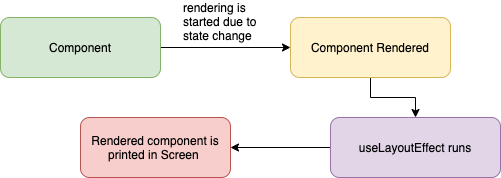

# 리액트

## Table of Contents

- [상태관리를 왜 할까요? 그리고 평소 state 관리는 어떻게 하시나요?✅](#1)
- [Redux가 무엇인가요, 왜 Redux를 사용하시나요?✅](#2)
- [Redux 말고 다른 전역 상태관리 아는 것 하나와 차이점을 말해주세요 ✅](#3)
- [버츄얼 돔과 리얼 돔의 차이를 설명해주세요 ✅](#4)
- [useRef에 대해 설명해보세요 ✅](#5)
- [useEffect의 실행 순서에 대해 설명해주세요 ✅](#6)
- [var, let, const의 차이에 대해 알려주세요. ✅](#7)
- [Async/Await와 Promise의 차이 ✅](#8)
- [데이터 10,000개를 가지고 무한 스크롤 구현시에 가장 중요하게 고려해야 할점은? ✅](#9)
- [CloudFront를 사용해본적이 있나요? 사용해봤다면, CloudFront로 배포하는 이유를 설명해주세요.✅](#10)
- [useEffect와 useLayoutEffect 차이에 대해 설명해주세요](#11)
- [Closure란?](#12)
- [Javascript 호이스팅에 대해 설명해주세요.](#13)
- [프로세스 생성 과정에 대해 설명해보세요](#14)
- [HTTPS란](#15)
- [TCP란 무엇인가](#16)
- [TCP와 UDP의 차이점은?](#17)
- [브라우저에서 주소창에 url 입력시 어떤일이 일어나는가](#18)
- [JavaScript Event Loop](#19)
- [RESTFul API란](#20)
- [GET, POST 방식의 차이점](#21)
- [Webpack 써보신 적 있나요](#22)
- [TCP와 UDP의 차이점](#23)
- [동기와 비동기의 차이](#24)
- [Array vs LinkedList](#25)
- [서버 사이드 렌더링이란?](#26)
- [MVC 패턴이란 무엇인가?](#27)
- [아토믹 디자인 패턴에 대해 아는가?](#28)
- [웹 스토리지의 차이점](#29)
- [http vs https 차이점에 대해 설명해주세요](#30)
- [웹 프로토콜이란?](#31)
- [AJAX란 무엇인가](#32)
- [Promise와 Callback의 차이점은](#33)
- [자바스크립트와 타언어의 차이점](#34)
- [ES6의 호환성 해결방법은?](#35)
- [babel은 컴파일러 인가 ? 트랜스파일러인가?](#36)
- [ES6에 추가된 것은 무엇인가?](#37)
- [Context API란?](#38)
- [라이프사이클 메소드에 대해 설명](#39)
- [react 클래스형과 함수형의 차이](#40)
- [타입스크립트란?](#41)
- [Angular와 React의 차이점](#42)
- [SEO란?](#43)
- [이벤트 위임이란?](#44)
- [메모이제이션이란?](#45)
- [이벤트 버블링이란](#46)
- [부모에서 자식으로 이벤트상속방법](#47)
- [이벤트버블링을 막는 방법](#48)
- [이벤트버블링 활용 방법](#49)
- [React, 왜 사용하시나요?](#50)

## 1

React에서의 상태관리란 데이터에 맞게 적절하게 UX와 UI를 설계하고 구현하는게 상태관리이다.
상태관리가 필요한 이유는 상태관리를 어떻게 하느냐에 따라 의미없는 리렌더 등 성능 이슈를 해결할 수 있고
어떤 상태 라이브러리를 활용하여 어떤구조로 상태관리를 설계해서 다루냐에 따라 유지보수 관점에서 코드의
라이프 사이클이 크게 짧아질수도 길어질수도 있기 때문이다. 먼저 상태관리의 예시를 들면

예를 들어, 인스타그램에서 팔로워수가 많아져서 1억명의 팔로워수가 생겼을때, 1명의 팔로워를 1로 표기하는 것과
1억명의 팔로워를 100000000이라고 표기하기에는 유저입장에서 읽기도 힘들고 너무길어 불필요하게 Box를 많이 차지하는
현상이 발생한다. 이렇게 표기하기에는 1.0억이라고 표기하는게 눈에 더 쉽게 들어오고 UI에 잘 맞다.

이렇게 동적으로 팔로워 상태를 바꾸며 이러한 행동을 팔로워 수 표기의 상태관리라고 한다. 이러한 상태관리는 팔로워 수
뿐만 아니라 댓글이 달려서 하트표시의 댓글이 달린 것이 UI적으로 변한 것을 알 수 있으며 이러한 상태관리는 실시간
상태관리라고 한다. 또한 프로필이 로딩상태일때 잠시 나오는 스피너나 Skeleton UI로 로딩중 표시를 노출 하는 것 또한
로딩상태관리라고 부릅니다. 이러한 상태관리 외에 에러 예외 상황에 대한 상태관리, 로그인한 유저의 권한을 보여주는 상태관리 등
프론트엔드에 쓰이는 상태는 매우 종류가 많고 상태의 조합에 따른 경우의 수를 다 고려해야 한다.

리액트 상태는 이렇게 역할외에도 범위의 측면에서 볼 때 State가 적은 수의 component또는 depth가 깊지 않은 component안에서
영향을 주는 지역상태(local state)또는 많은 컴포넌트와 depth가 깊은 component에 영향을 주는 전역적상태(global state)로 나눌 수 있다.

평소 state관리는 이러한 역할과 범위 측면에 따라 나누어 최소한의 리렌더링 및 페이지 성능을 최대한 끌어올리는 방향으로 관리하고
있습니다.

Reference:

- [프론트엔드의 상태관리란 무엇인가?](https://medium.com/wematch/%ED%94%84%EB%A1%A0%ED%8A%B8%EC%97%94%EB%93%9C%EC%9D%98-%EC%83%81%ED%83%9C%EA%B4%80%EB%A6%AC%EB%9E%80-%EB%AC%B4%EC%97%87%EC%9D%B8%EA%B0%80-5ff888dab7ad)
- [React state management: What is it and why to use it?](https://www.loginradius.com/blog/engineering/react-state-management/)
- [리액트 상태 관리 가이드](https://www.stevy.dev/react-state-management-guide/)

[🔝 목차로 돌아가기](#table-of-contents)

## 2

Redux는 프론트엔드 상태관리 라이브러리이다. Redux는 웹의 규모가 커지면서 components가 점점 잘게 쪼개지며 한 컴포넌트의 depth
단위가 점점 깊어지면서 부모에서 자식간의 props를 전달하는 과정에서 해당 props가 불필요한 component에서도 전달 받고 보내야 하는
상황인 props drilling 문제와 똑같은 depth level의 자식이 state을 관리할때 props를 서로 전달받을 수 없는 상황에 state을 store라는
제 3자의 공간에서 components들이 필요한 상태를 담아 적절히 필요할 때 언제든지 꺼내고 새로운 state을 업데이트 할 수 있게
도와주는 효과적인 라이브러리이다.

Redux를 항상 써야 하는 건 아니지만 components 단위의 depth가 깊거나 같은 레벨의 depth의 child component에서 props를 전달받아야
하는 상황일 때 쓰면 효과적이다. 또한 리액트에 내장된 Context API로 글로벌상태를 관리할 수 있지만 성능면에서 차이가 난다.
Redux에서는 components에서 글로벌 상태의 특정 값을 의존하게 될 때 해당 값이 바뀔 때에만 리렌더링이 되도록 최적화가 되어있다.
따라서, 글로벌 상태 중 의존하지 않는 값이 바뀌게 될 때에는 컴포넌트에서 낭비 렌더링이 발생하지 않는다.

Reference:

- [리덕스, 어떻게 해야 잘 쓸까](https://ridicorp.com/story/how-to-use-redux-in-ridi/)
- [Redux FAQ: General](https://redux.js.org/faq/general)
- [Redux(리덕스)란?](https://hanamon.kr/redux%EB%9E%80-%EB%A6%AC%EB%8D%95%EC%8A%A4-%EC%83%81%ED%83%9C-%EA%B4%80%EB%A6%AC-%EB%9D%BC%EC%9D%B4%EB%B8%8C%EB%9F%AC%EB%A6%AC/)

[🔝 목차로 돌아가기](#table-of-contents)

## 3

Redux외에 여러 상태관리 라이브러리가 있지만 그 중 Recoil에 대한 언급을 하고 싶다. Recoil은 페이스북에서 만든 Context API
기반으로 구현된 함수형 컴포넌트에서만 사용가능한 상태관리 라이브러리이다. Redux는 효과적인 상태관리 라이브러리이지만
너무 많은 보일러 플레이트를 파일마다 반복 작성해야 하는 큰 단점이 있었다. 예를 들어 리덕스 액션과 리듀서들을 도메인마다
분리를 하고 리액트 각 컴포넌트마다 바인딩을 하게 될 시 많은 파일에서 리덕스 코드를 사용하게 되고 많은 양의 보일러 플레이트
코드를 반복해야해서 관리포인트가 많다는 단점이 있었다.

이러한 보일러플레이트를 해결하고 Redux Thunk와 Redux Saga(비동기처리 라이브러리)등 비동기 처리 미들웨어를 추가로 설치하지
않아도 되는 Redux Toolkit이 등장하였지만 아직 recoil에 비해 보일러플레이트가 높으며 recoil은 기존 React의 내장 Hooks사용하는
방식과 유사하며 어플리케이션을 RecoilRoot으로 감싸고 데이터를 atom(작은 단위로 컴포넌트들이 구독할 수 있는 단위)이라는 단위로
선언하여 useState을 Recoil의 useRecoilState으로 대체하는 특징을 가지고 있다.

Recoil의 selector를 활용하여 쉽게 비동기 데이터를 가져올 수 있으며 추가적인 라이브러리 설치가 불필요해 프로젝트 번들이 가벼우며
기존의 Redux의 중앙집중식으로 상태관리가 이루어지며 단방향인 Flux 아미텍처와 달리 저장소 개념보다 작은 상태 단위인 atom이라는
상태 단위로 상태를 관리하여 컴포넌트는 이 atom을 구독하기만 하면 된다는 큰 차이점을 가지고 있다.

- [Recoil Code 예시](./code/recoil.jsx)

Redux와 Recoil

Reference:

- [Redux vs Recoil: which should you use?](https://www.emgoto.com/redux-vs-recoil/)
- [Reducing Boilerplate](https://redux.js.org/usage/reducing-boilerplate)
- [Recoil, 리액트의 상태관리 라이브러리](https://tech.osci.kr/2022/06/16/recoil-state-management-of-react/)

[🔝 목차로 돌아가기](#table-of-contents)

## 4

DOM은 Document Object Model의 약자로 HTML 문서에 있는 모든 node의 구조적 표현이다. DOM은 어플리케이션의 UI를
나타내며 이러한 웹페이지의 UI를 동적으로 변경하려면 DOM 조작이 필요하다. DOM은 스크립트가 문서의 내용, 스타일 및
구조를 업데이트 할 수 있도록 하는 인터페이스이다.

실제 DOM은 논리적 트리가 있는 문서라고 불리며 트리의 각 분기는 노드로 끝나며 각 노드에는 객체가 포함이 된다.
DOM은 트리와 같은 구조로 인해 빠르지만 변경 후에는 업데이트가 된 요소와 자식들을 다시 렌더링하여 어플리케이션
UI를 업데이트해야 하여 UI를 재렌더링시 모든 UI 구성 요소가 느려진다. 모든 DOM 업데이트에 대해 렌더링이 되므로
실제 DOM은 업데이트를 수신하는 특정 항목뿐만이 아닌 전체 목록을 렌더링하게 된다.

이러한 문제를 해결하고자 React에서는 모든 DOM객체에 해당하는 "가상 DOM객체"가 있다. 가상 DOM객체는 실제 DOM객체와
동일한 속성을 갖지만 화면에 있는 내용을 직접 변경할 수는 없다. 가상DOM을 조작하는 것은 화면에 직접 그리지 않기
때문에 실제DOM보다 훨씬 빠르며 React는 우선 모든 단일 가상 DOM을 업데이트하며 이후 가상 DOM이 업데이트 되면 그
전 가상 DOM과 비교하여 어떤 가상 DOM 요소가 변경되었는지 알아내며 해당 요소만 업데이트 하게 하는 "diffing"이라는
프로세스를 실행합니다.

Reference:

- [The Document Object Model](https://eloquentjavascript.net/14_dom.html)
- [React: The Virtual DOM](https://www.codecademy.com/article/react-virtual-dom)
- [Difference between Virtual DOM and Real DOM](https://www.geeksforgeeks.org/differnece-between-virtual-dom-and-real-dom/)

실제DOM과 가상DOM 원리(React)

[🔝 목차로 돌아가기](#table-of-contents)

## 5

Javascript에서는 우리가 특정 DOM을 선택해야 하는 상황에는 getElementById, querySelector와 같은 DOM Selector 함수를
사용해서 DOM을 선택한다. 리액트에서도 스크롤바 위치를 가져오거나 선택하고, 포커스를 설정하는 등 DOM을 직접 선택해야
하는 상황이 있고 특정 DOM을 감시하고 가리킬 때 useRef Hook을 사용한다. 그리고 해당 DOM의 특정 값을 가져올 때
.current.value, .current.focus등의 코드로 해당 DOM의 값을 불러올 수 있습니다.

- [useRef Code 예시](./code/useRef.jsx)

Reference:

- [후크 API 참조](https://reactjs.org/docs/hooks-reference.html#useref)
- [useRef로 특정 DOM 선택하기](https://react.vlpt.us/basic/10-useRef.html)

[🔝 목차로 돌아가기](#table-of-contents)

## 6

useEffect Hook은 의존성배열(dependency array)내에 지정된 값의 변화가 일어났을 때 실행이 된다. 이러한 특성으로 주로
컴포넌트가 마운트가 될 때 API를 통해 데이터를 가져오거나 state 또는 props 값이 변경될 때 특정 함수를 실행시키는 작업을
하는데 사용이 된다.

컴포넌트 구조가 top -> bottom으로 가는 구조 App > FirstBox > SecondBox일때 useEffect는 컴포넌트가 렌더링이 된 후에 실행이
되기 때문에 App이 render가 되기 위해서는 FirstBox가 렌더링이 되어야 하고 FirstBox가 완전히 렌더링이 되기 위해서는 SecondBox가
렌더링이 되어야 한다. 그렇게 1 -> 2 -> 3 순서대로 실행이 되는 것이 아닌 3 -> 2 -> 1 순서대로 실행이 된다.

- [useEffect Code 순서](./code/useEffect.jsx)

Reference:

- [useEffect의 동작 원리](https://jungpaeng.tistory.com/92)
- [What's useEffect execution order and its internal clean-up logic in react hooks?](https://stackoverflow.com/questions/53781632/whats-useeffect-execution-order-and-its-internal-clean-up-logic-in-react-hooks)
- [Library Hooks](https://reactjs.org/docs/hooks-reference.html#library-hooks)

[🔝 목차로 돌아가기](#table-of-contents)

## 7

var, let, const는 공통적으로 변수 선언문들인데 스코프 레벨에 따라 var는 함수 레벨 스코프이며 let, const는 블럭 레벨 스코프이다.
var, let, const 모두 호이스팅이 가능하지만 var의 경우 호이스팅이 되면서 초기값이 없어도 자동으로 undefined를 초기값으로
메모리 할당하는 특징이 있다. 하지만 let, const는 선언 전에 메모리에 해당 변수가 존재하지 않는다. 이럴 때 ReferenceError:
Cannot access 식별자명 before initialized가 발생한다.

var, let은 값을 재할당할수 있으며 const 같은 경우는 한번 할당한 값을 변경할 수 없다(객체 속 property 변경 x). 변수를 가리키는
값 자체를 변경하려고 할 때는 에러가 발생하지만 객체 내 property 추가, 수정, 삭제일 경우는 에러가 발생하지 않는다. 만약 객체
property를 변경하고 싶은 경우 Object.freeze()를 활용하면 된다. 그리고 중복변수명 선언일 경우 var는 이미 존재하는 동일한
변수명이 선언 가능하지만 let, const일 경우는 에러를 발생시킨다.

Reference:

[var, let, const: what's the difference?](https://dev.to/romaintrotard/var-let-const-what-s-the-difference-2eh0)
[Difference between var, let and const keywords in JavaScript](https://www.geeksforgeeks.org/difference-between-var-let-and-const-keywords-in-javascript/)

[🔝 목차로 돌아가기](#table-of-contents)

## 8

Promise는 자바스크립트에서 비동기 처리에 사용되는 객체이며 내용은 실행되었지만 결과를 아직 반환하지 않은 객체를 의미한다.
async, await은 가장 최근에 나온 비동기 처리 문법으로 기존의 callback이나 Promise의 단점을 해소하고자 만들어졌다.
Promise에는 3가지 상태(Pending - 대기, Fulfilled - 이행, Rejected - 실패)가 있으며 async, await은 이러한 상태가
없으며 promise 자체를 리턴하거나 실패처리 합니다.

"fxn1" 함수가 Promise이후에 실행되는 경우, promise.then(fxn1)은 fxn1 호출을 콜백 체인에 추가한 후 현재 함수의 실행을
계속하며 async,await일 경우 함수 "fxn1"이 await후에 실행되는 경우 await X()는 현재 함수의 실행을 일시 중단한 후
fxn1이 실행이 된다.

Promise에는 오류처리를 .then() 과 .catch() 메소드를 사용하며 async/await은 에러를 따로 핸들링 할 기능이 없기에 try-catch()
문을 활용하여 에러를 핸들링 해주어야 한다. Promise에서는 끝없는 .then() 사용 가능성이 있어 가독성이 좋지 않으며 async/await은
비동기 코드가 동기 코드처럼 읽히며 코드의 흐름을 이해하기 더 쉬운 편이다.

Reference:

[Difference between promise and async await in Node.js](https://www.geeksforgeeks.org/difference-between-promise-and-async-await-in-node-js/)

[🔝 목차로 돌아가기](#table-of-contents)

## 9

데이터가 일정 숫자가 많아질 때 기존의 무한 스크롤 구현 방법 중 스크롤 위치에 따라 bottom을 터치 시 새로운 페이지를 불러오는 방식에
특정한 조건을 걸지 않을 시 렌더링이 생각보다 많이 일어날 가능성이 있다. 이러한 문제를 해소시키고자 다양한 방법이 있는데 우선
lazy loading과 suspense를 사용하여 지연로딩을 통해 빠른 초기 로딩속도(FCP)를 가져가면서 스크롤이 많이 쌓여가는 방법을 어느정도 해소
시키는 방법이 있다. 또한 적절한 useMemo()와 useCallback()함수를 통하여 연산한 값을 재사용하거나 get하는 함수 자체를 page나 loading이 바뀔때마다 재사용하여 불필요한 리렌더링을 방지하는 방법또한 있다.

하지만 애초에 페이지를 많이 불러오면 그 내용을 그리기 위해 DOM 노드가 많이 생기는데 노드가 증가하면 렌더링하는 시간도 선형적으로 증가하기에 데이터를 추가로 덧붙인다는 생각의 접근은 이 근본적인 문제를 해결할 수 없다. 그리하여 유저가 보려고 하는 데이터만
불러와서 표시하는 방법의 접근이 필요하다. 즉 화면에 현재 표시되는 객체만 표시하고 나머지는 빈칸으로 두어 DOM 노드수를 절약하며 유저가 실제로 보고 싶어하는 데이터만 가져와서 유저가 어느 방향으로 스크롤하든 이어서 더 불러오게 가능하게 하면 된다는 것이다.

화면에 이렇게 표시되는 객체만 그리는 작업을 "DOM 가상화"라고 하며 이를 위하여 react-virtualized 또는 더 용량이 작은 react-window등의 라이브러리를 활용하여 한 줄에 보여줄 카드 수를 렌더링하는 시점에 미리 넣는 방법으로 구현하는 방법들이 있다.

Reference:

[오늘의집 내 무한 스크롤 개발기](https://www.bucketplace.com/post/2020-09-10-%EC%98%A4%EB%8A%98%EC%9D%98%EC%A7%91-%EB%82%B4-%EB%AC%B4%ED%95%9C%EC%8A%A4%ED%81%AC%EB%A1%A4-%EA%B0%9C%EB%B0%9C%EA%B8%B0/)

[🔝 목차로 돌아가기](#table-of-contents)

## 10

Cloudfront를 사용해본적이 있다. Cloudfront는 .html, .css, .js와 같은 정적 및 동적 웹 콘텐츠를 사용자에게 더 빨리 배포하도록 지원하는 웹 서비스입니다. Cloudfront에는 엣지 로케이션이라고 하는 데이터 센터의 전 세계 네트워크를 통해 콘텐츠를 제공하며 사용자가 요청하면 지연 시간이 가장 낮은 엣지 로케이션으로 요청이 라우팅되기에 가능한 최고의 성능으로 콘텐츠 제공. 이렇게 세계 곳곳에 서버를 구축하는게 힘들며 모든 리전에 EC2 인스턴스나 S3 버킷을 생성하는건 비효율적이며 비용이 많이 드는 문제를 Cloudfront를 이용하여 전송속도 향상과 비용절감을 이룰 수 있다. 또한 Cloudfront 엣지 캐시에서 파일이 만료되기 전에 파일을 제거해야 할 경우 엣지 캐시에서 파일을 무효화 할 수 있으며 이 과정은 Github Actions 등을 통하여 자동화를 할 수 있다.

Cloudfront 작동 Table

Reference:

[Amazon CloudFront란 무엇입니까?](https://docs.aws.amazon.com/ko_kr/AmazonCloudFront/latest/DeveloperGuide/Introduction.html)
[파일 무효화](https://docs.aws.amazon.com/ko_kr/AmazonCloudFront/latest/DeveloperGuide/Invalidation.html)

[🔝 목차로 돌아가기](#table-of-contents)

## 11

- Render: DOM Tree 를 구성하기 위해 각 엘리먼트의 스타일 속성을 계산하는 과정
- Paint: 실제 스크린에 Layout을 표시하고 업데이트하는 과정

useEffect는 components들이 render와 paint가 완료된 후 실행이 된다. 이 과정은 비동기적으로 실행이 되며 paint된 후 실행이 되기 때문에 useEffect 내부에 DOM에 영향을 주는 코드가 존재할 경우 사용자는 화면의 깜빡임 현상을 겪게 된다.

useLayoutEffect는 components들이 render된 후 실행되며 그 이후에 paint가 된다. 이 과정은 동기적으로 실행이 되며 paint 되기 전에 실행이 되기 때문에 DOM에 영향을 주는 코드가 존재하여도 사용자는 화면의 깜빡임 현상을 겪지 않는다.

그리하여 useLayoutEffect는 동기적으로 실행이되고 내부의 코드가 모두 실행된 경우 painting 작업을 거치기 때문에 로직이 복잡할 경우 사용자가 레이아웃을 보는데까지 시간이 오래 걸린다는 문제가 있어서 데이터 fetch, event handling, state reset등의 작업은 useEffect를 사용하기를 권장하지만 화면이 깜빡거리는 상황일 때 state이 조건에 따라 첫 painting시 다르게 렌더링 되어야 하는 상황일때는 useLayoutEffect를 사용하기를 권장한다.

useEffect와 useLayout Life Cycle

Reference:

[What is the real difference between React useEffect and useLayoutEffect?](https://pubudu2013101.medium.com/what-is-the-real-difference-between-react-useeffect-and-uselayouteffect-51723096dc19)
